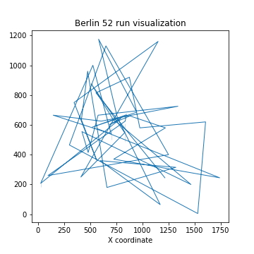

# ACO Framework

---

### 1. Introduction:


ACO Framework is created for <b><i>"Inteligencja Obliczeniowa"</i></b> course on 
<i>University of Science and Technology in Cracow.</i>  
Created to effective solve Ant Colony Optimization problems in Scala. 
It's also prepared for multi objective optimization.

---

### 2. Implemented solutions:

Currently, there are implemented algorithms for:
1. Single Objective Ant Colony Optimization named `Tsp` for Travelling Salesman Problem
2. Multi Objective Ant Colony Optimization maned `Mtsp` also for TSP kind of problems

<b> Architecture Diagram: </b><br>


<p>All abstract classes are named with pattern `Base___.scala`, those classes inform user
about functions that must be implemented to run algorithm.</p>

---

### 3. Usage:

Needed steps:
1. Use `config.yaml` file to determine problem files. Example:  

```
problemType: mtsp
problemFiles:
  - mtsp//dimacs_15_a.tsp <br>
  - mtsp//dimacs_15_b.tsp <br>
  - mtsp//dimacs_15_c.tsp <br>
```

Where:  
- `problemType` - type of optimization problem (currently available `tsp` or `mtsp`)
- `problemFiles` - input problem files

2. Used algorithm define all remaining parameters. Quick description:
- `increment` - defines value that will be added to pheromone table when ant pass selected edge
- `alpha` - power used in pheromone calculation as 
- `beta` - power used in distance heuristic as 
- `extinction` - percentage loss of pheromone value after each algorithm iteration
- `distanceWeights` - weights used to flatten distances in multi objective calculations, should sum up to 1
- `pheromoneWeights` - weights used to flatten pheromone values, should sum up to 1
- `antNumb` - number of ants used for optimization (declared in `Main.scala`)
- `iteration` - number of iterations that algorithm can evaluate (declared in `Main.scala`)
- `rnd` - random number generator (you can set seed to create more deterministic results)
- `takenAntsToPheromoneUpdate` - used only in TSP problems, determine how many ants update
pheromone table (based on fitness value)

3. Run `Main.scala` to run algorithm, results will be printed in console.
This file only read the selected problem and map it into `BaseProblem` instance, 
that can be further evaluated.  

4. Prepared solutions offers algorithms:
- weighted sum - for distance and pheromone flattening
- tbd

5. Included problems:
- Berlin 52 - dataset with 52 dimensions (locations from Berlin) from 
[here](http://elib.zib.de/pub/mp-testdata/tsp/tsplib/tsp/berlin52.tsp).
- DIMACS 15 - dataset with 15 dimensions in 3 different objectives (a, b, c), you can find it 
[here](https://sites.google.com/site/kflorios/motsp)
- Lust 100 - dataset with 100 dimensions in 2 objectives (A, B), also from
[here](https://sites.google.com/site/kflorios/motsp)
- Paquete 100 - dataset with 100 dimensions in 2 objectives (A, B) [here](https://sites.google.com/site/kflorios/motsp)

---

### 4. Results:

Testing results:  
On included into Framework dataset `Berlin 52`, we performed test run. Here are the results:  
Data set visualization:  
  
Selected parameters:  

| Parameter | Value |
| ----------- | ----------- |
| increment | 5 |
| alpha | 1 |
| beta | 1 |
| extinction | 0.2 |
| distanceWeights | 1.0 |
| pheromoneWeights | 1.0 |
| takenAntsToPheromoneUpdate | 30 |
| ants_number | 30 |
| algorithm_iterations | 100 |

Results:  

  
Best Fitness: 8356.66  
`NOTE` Currently there is no visualization methods in Framework!

---

### 5. Possible Further Work:

- [ ] Adding More Algorithms to solve different problems
- [ ] Adding Visualization Methods (e.g. Front Pareto)


---

#### Authors:
<p>Krzysztof Tylka-Suleja <i> Email: tylkasuleja@student.agh.edu.pl </i><br>
Tymoteusz Dobrzański <i> Email: tdobrzanski@student.agh.edu.pl </i><br></p>

In cooperation with:<br>
<p>Aleksander Byrski <i> Email: olekb@agh.edu.pl </i> <br>
Mateusz Starzec <i> Email: starzec.mateusz@gmail.com </i><br>
Grażyna Starzec <i> Email: gstarzec@agh.edu.pl </i><br></p>
